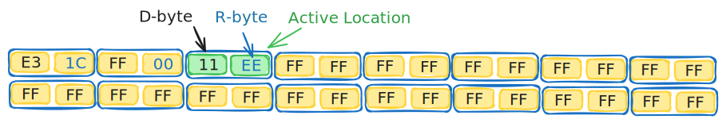

# 𒁈💾 LongLiveThEEPROM

> **Status:** `STABLE`  
> **Target:** AVR / Arduino Architecture  
> **Objective:** Maximize Arduino EEPROM lifespan

Standard AVR EEPROM is rated for approximately **100,000** write/erase cycles. **LongLiveThEEPROM** bypasses this physical bottleneck using a **Ring Buffer Wear-Leveling** strategy, distributing the electron-tunneling stress across the entire silicon surface.

Regular use of Standard Arduino EEPROM library results in hammering single cell in EEPROM (you write and read to/from same address). With this library you prevent hammering EEPROM and distributing load across whole area.

---

### 🛠️ Technical Specifications

| Metric | Standard EEPROM | With LongLiveThEEPROM |
| :--- | :--- | :--- |
| **Endurance (Uno/Nano)** | ~100k cycles | **~50M writes** (500x Boost) |
| **Endurance (Mega)** | ~100k cycles | **~200M writes** (2000x Boost) |
| **Integrity Check** | None | Bit-Inversion Redundancy |
| **Failure Mode** | Silent Corruption | Active Validation Trigger |

---

### 🧠 Core Mechanics

#### 🔄 Wear-Leveling (The Ring Buffer)
Instead of hammering address `0x00` into oblivion, the library treats a allocated memory block as a continuous loop. Each write operation increments a head pointer to the next cell, ensuring every byte of available space is utilized equally before any single cell is rewritten.

#### 🛡️ Bit-Rot Protection
To detect "stuck bits" (common in aging floating-gate transistors), we store an **Inverted Redundancy Value**:
* **Data Byte:** `B`
* **Validation Byte:** `~B` (Bitwise NOT)
* This maximizes the detection of hardware-level failures where bits become physically unable to flip state.

---

### ⚙ Implementation details

Area designated for Preference Storage is split on chunks. Each chunk is split on locations 2 bytes each.



---

### 💻 How to use it

Find `LongLiveThEEPROM` library in Arduino library manager and install it.

Use code below or any check other examples.

```cpp
#include <pref_one_byte.h>

PrefOneByte preferences;

void setup() {
  uint8_t prefByte = preferences.load(); // Load one byte from storage area (by default whole EEPROM is allocated to this Preference)

  if (preferences.isEmpty()) {
    prefByte = 0x10; // Set Default value at first run or after EEPROM was erased
  }
  
  preferences.save(prefByte); // Store preference into storage area
}

void loop() {
}
```

### ⚖️ Final Verdict
Writing to EEPROM inside a `loop()` is usually a "death sentence" for your MCU.
LongLiveThEEPROM provides the abstraction layer necessary to turn a potential hardware failure into decades of reliable operation.

### 📂 FAQ
  > **Q: What if I need more then one byte to store?**
  > **A:** You can use multiple `PrefOneByte` storages, see `TwoPreferences` example.

  > **Q: What if I need some of EEPROM area to be allocated to my needs?**
  > **A:** This can be easily achieved by custom configuration of `PrefOneByte`, see `Advanced` example.

  > **Q: How my sketch should know that EEPROM is corrupted?**
  > **A:** After attempt to read/write to `PrefOneByte`, call `isSuccess()` method. If it returns false - most likely EEPROM is corrupted, or you logic was writing into storage area. `getLastError()` provides more detail error code on whats happened.